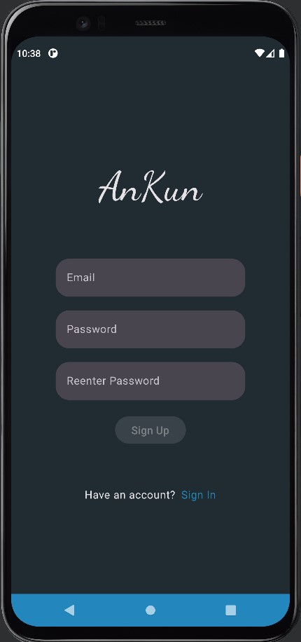
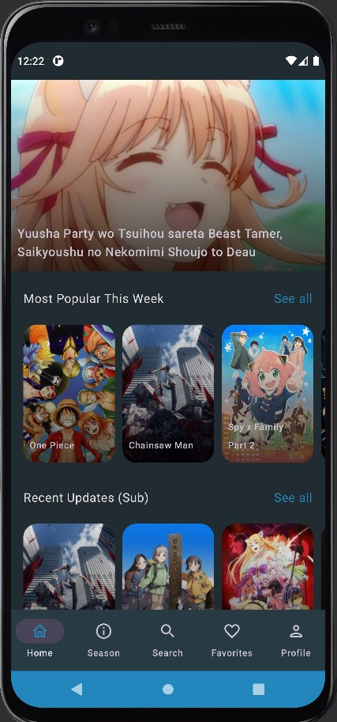
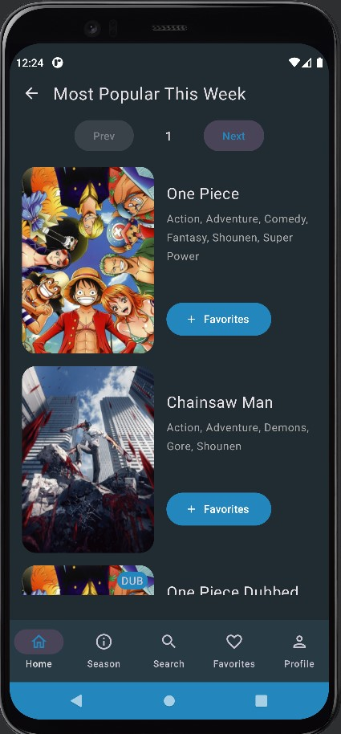
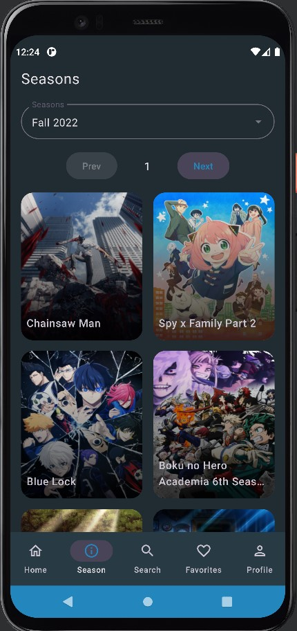
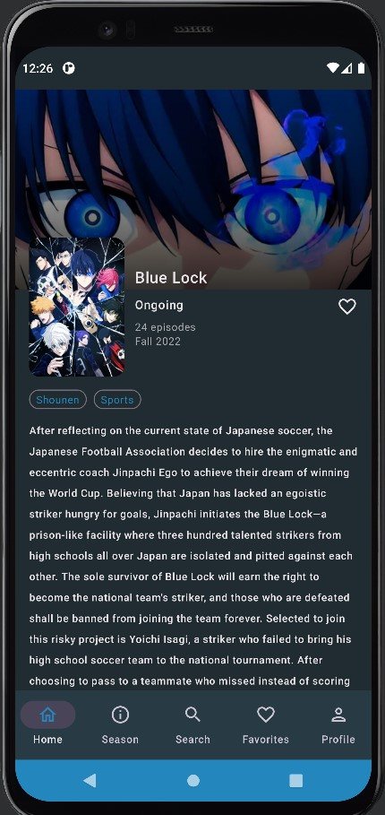

# AnKunv2
### ***Has a more recent version built with Flutter [AnKunv2-flutter](https://github.com/alberterc/AnKunv2-flutter).***
***The API used is not maintained by me and may cause issues.***

AnKunv2 is an app a bit similar to YouTube but to stream anime.

Updated from [AnKun](https://github.com/RadXGH/AnKun) using Jetpack Compose.

# Tech Stack
- Kotlin
- AndroidX
- UI - [Jetpack Compose](https://developer.android.com/jetpack/compose)
- HTML parser - [Jsoup](https://jsoup.org/)
- Image from URL loader - [Coil](https://coil-kt.github.io/coil/compose/)
- Image slider - [Google Accompanist - HorizontalPager](https://google.github.io/accompanist/)
- Authentications and Firestore Database - [Firebase](https://firebase.google.com/docs)

# App Preview

